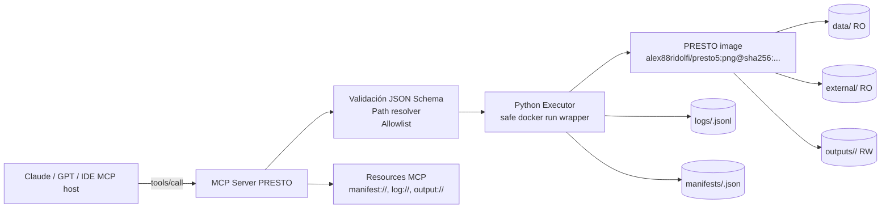
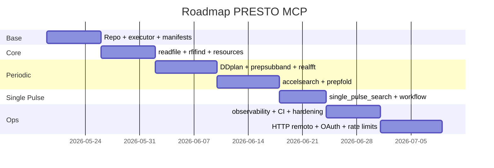

# Informe para construir un MCP Server de PRESTO

## Resumen ejecutivo

La forma más eficiente y segura de construir un **MCP Server para PRESTO** hoy es **no envolver un shell genérico**, sino exponer un subconjunto curado de rutinas PRESTO como **tools tipadas**, ejecutar cada corrida dentro de un **contenedor Docker endurecido**, y registrar cada ejecución con un **manifest reproducible**. PRESTO mismo ya documenta un camino oficial basado en Docker/Singularity y recomienda las imágenes `alex88ridolfi/presto5:latest` y `alex88ridolfi/presto5:png`; para tu caso conviene priorizar `:png` porque habilita la generación de PNGs útiles en `prepfold`. MCP, por su parte, está diseñado justamente para exponer herramientas con esquemas JSON claros sobre `stdio` o `Streamable HTTP`, con soporte para progreso en operaciones largas.

El alcance correcto para la **v1** es **solo PRESTO**: `readfile`, `rfifind`, `DDplan.py`, `prepsubband`, `realfft`, `accelsearch`, `single_pulse_search.py`, `prepfold`, y, si hace falta para completar un flujo periódico limpio, `prepdata` como rutina interna o secundaria. El tutorial oficial de PRESTO describe exactamente ese pipeline operativo, desde inspección de datos hasta búsqueda periódica, búsqueda de pulsos individuales y folding. En cambio, **PulsarX**, **TransientX** y **riptide** son stacks distintos; pueden ser compatibles a nivel de archivos o ideas operativas, pero **no son PRESTO** y no deberían entrar al mismo MCP en la primera versión. **PULSAR_MINER** sí es un wrapper de PRESTO y vale la pena reutilizarle ideas de orquestación y reanudación, pero hoy su propio README advierte que **no es compatible con PRESTO 5+**, así que no debe ser la base de la implementación. 

La decisión arquitectónica central, entonces, es ésta: **MCP fino + executor Python seguro + Docker endurecido + manifests + recursos MCP para leer resultados**. Primero conviene publicar el servidor por **`stdio` local**, porque MCP documenta que ese transporte es óptimo para procesos locales, y además simplifica el modelo de seguridad. Después, si de verdad necesitas conectarlo como conector remoto para Claude o clientes web, puedes agregar **`Streamable HTTP`** con autenticación OAuth 2.1, scopes mínimos, y rate limiting por 

## Alcance y decisiones de arquitectura

PRESTO es una suite grande de búsqueda y análisis de púlsares, escrita principalmente en C con rutinas recientes en Python, y soporta de forma oficial **PSRFITS search-format**, **SIGPROC filterbank**, series de tiempo en **`.dat` + `.inf`**, y formatos de eventos. Su README también organiza las rutinas en preparación de datos, búsqueda, folding y utilidades; ahí aparecen explícitamente `rfifind`, `prepsubband`, `accelsearch`, `single_pulse_search.py`, `prepfold`, `readfile` y `DDplan.py`. 

La parte importante para el MCP no es “exponer todo PRESTO”, sino **exponer lo que tiene semántica estable y no interactiva**. El tutorial oficial de PRESTO marca un flujo muy claro: `readfile` para inspeccionar el archivo, `rfifind` para RFI, `prepdata` y `realfft` para series/FFT, `DDplan.py` para plan de dedispersión, `prepsubband` para dedispersión, `accelsearch` para búsqueda periódica, `single_pulse_search.py` para transientes, y `prepfold` para folding y optimización de candidatos. Ese flujo es el mejor criterio para decidir la v1 del MCP. 

En cuanto a formatos de entrada, el MCP debería declarar soporte garantizado para:

- **`.fil`** SIGPROC filterbank  
- **`.fits`** PSRFITS search-mode  
- **`.dat` + `.inf`** para `realfft`, `accelsearch`, `single_pulse_search.py` y pasos intermedios  
- **`.sf`** solo como compatibilidad **a validar con muestras reales**, porque la mención explícita a `.sf` aparece en PULSAR_MINER como “psrfits `.fits`/`.sf`”, mientras que la documentación oficial de PRESTO habla de PSRFITS search-format de forma más general. 

La recomendación de exposición MCP para v1 es separar **tools atómicas** de **workflows compuestos**. MCP distingue tools, resources y prompts; para este caso conviene usar **tools** para ejecutar rutinas y **resources** para leer manifiestos, logs y listados de outputs. No hace falta complicar la primera versión con prompts. 

Un mapa de componentes adecuado sería el siguiente:



MCP soporta `stdio` para comunicación local directa y `Streamable HTTP` para servidores remotos con autenticación estándar; como PRESTO es una carga de trabajo larga y con outputs en archivos, el patrón más limpio es: **tool -> run_id -> resources**. 

Las **tools** mínimas recomendadas son las siguientes:

| Tool MCP | Propósito | Salida principal |
|---|---|---|
| `presto_readfile` | Inspección de metadata | `stdout`, metadata parseada, manifest |
| `presto_rfifind` | Máscara y stats de RFI | `.mask`, `.stats`, `.inf`, gráficos |
| `presto_ddplan` | Plan de dedispersión | texto/tabla, script opcional |
| `presto_prepsubband` | Dedispersión multicanal | `.dat`/`.inf` o `.sub*` |
| `presto_realfft` | FFT / inverse FFT | `.fft` o `.dat` derivado |
| `presto_accelsearch` | Búsqueda periódica/acelerada | `.cand`, `.ACCEL_*` |
| `presto_single_pulse_search` | Búsqueda de pulsos individuales | `.singlepulse`, plots |
| `presto_prepfold` | Folding/optimización | `.pfd`, `.bestprof`, imágenes |
| `presto_periodic_workflow` | Macro segura del flujo periódico | manifest maestro + artifacts |
| `presto_single_pulse_workflow` | Macro segura del flujo transiente | manifest maestro + artifacts |

La versión `:png` de la imagen es preferible específicamente porque PRESTO documenta que la variante con PNG incluye `pstoimg` vía `latex2html`, necesario para producir las versiones `.png` de los `.pfd.ps` generados por `prepfold`. citeturn4view0turn4view1

## Seguridad y modelo operacional

El principio rector debe ser **“no ejecución arbitraria”**. El documento oficial de seguridad de MCP advierte contra modelos donde un cliente o configuración local puedan disparar comandos de arranque opacos, y exige consentimiento claro, sandboxing y privilegios mínimos para servidores locales. Para tu caso, eso significa que el MCP **no debe aceptar un string shell**; en vez de eso, cada tool debe mapear a una rutina PRESTO fija con parámetros tipados y validados por esquema. El executor Python debe construir un `argv` explícito y llamar `subprocess.Popen(..., shell=False)`.

Además, conviene aprovechar el endurecimiento nativo de Docker. Docker documenta que un contenedor puede ejecutarse con límites de CPU, memoria y PIDs; que puede montarse con **filesystem raíz read-only**; que los bind mounts pueden ser **read-only**; que `tmpfs` sirve para estado temporal no persistente; que `--network none` aísla completamente la red del contenedor; que `--cap-drop` reduce capacidades; que `--security-opt no-new-privileges=true` impide ganar nuevos privilegios; y que el perfil seccomp por defecto es un allowlist razonable y no conviene deshabilitarlo. También documenta que correr contenedores/procesos como usuario no privilegiado, usar AppArmor/SELinux y, cuando aplique, usar **rootless** o **userns-remap**, mejora el aislamiento. 

Eso se traduce operativamente en un comando base cercano a esto:

```bash
docker run --rm --pull=never \
  --network none \
  --cpus 4 \
  --memory 8g \
  --pids-limit 256 \
  --read-only \
  --tmpfs /tmp:rw,noexec,nosuid,size=1g \
  --cap-drop ALL \
  --security-opt no-new-privileges=true \
  --mount type=bind,src=/srv/presto/data,dst=/data,ro \
  --mount type=bind,src=/srv/presto/external,dst=/external,ro \
  --mount type=bind,src=/srv/presto/outputs/run_123,dst=/outputs,rw \
  -u 1000:1000 \
  alex88ridolfi/presto5:png@sha256:<digest> \
  readfile /data/obs.fil
```

En producción, la imagen debería ejecutarse **por digest** y con `--pull=never`, porque Docker soporta referenciar imágenes por digest inmutable, y esa práctica hace más reproducibles las corridas que usar tags flotantes.

El control de paths debe ser igual de estricto. Todos los paths entrantes deben resolverse contra raíces aprobadas, negar traversal (`..`), seguir y validar symlinks, y montar solo cuatro espacios conocidos: `data/` y `external/` como **RO**, `outputs/<run_id>/` como **RW**, y `logs`/`manifests` escritos por el host. No montes el socket de Docker dentro del worker: Docker documenta que bind-mountear `/var/run/docker.sock` con un binario Docker da **acceso total al daemon del host**.

El modelo de autenticación cambia según el transporte. Para **`stdio` local**, la propia documentación MCP dice que puedes usar credenciales de entorno o credenciales embebidas localmente, y que OAuth está pensado sobre todo para transporte HTTP remoto. Para **servidor remoto**, MCP recomienda OAuth 2.1, challenges `WWW-Authenticate`, Protected Resource Metadata, scopes mínimos y validación token/audience con librerías maduras, no lógica casera. También recomienda scopes progresivos de mínimo privilegio y advierte que el servidor **no debe usar la sesión como autenticación**: debe verificar cada request entrante y tratar `Mcp-Session-Id` como input no confiable.

Para un PRESTO MCP remoto, una partición sensata de scopes sería esta, como recomendación de ingeniería: `mcp:tools-read` para `readfile` y lectura de manifiestos, `mcp:tools-run-core` para `rfifind`, `DDplan` y `realfft`, `mcp:tools-run-search` para `prepsubband`, `accelsearch`, `single_pulse_search.py`, `prepfold`, y `mcp:admin-observe` para métricas o endpoints administrativos. Claude además permite configurar permisos de tools por conector remoto, así que puedes duplicar esa defensa a nivel de cliente.

## Diseño del MCP, del executor y del almacenamiento

La separación correcta es **MCP surface** arriba y **executor** abajo. El MCP debe hacer tres cosas: validar inputs con JSON Schema, llamar al executor seguro, y devolver un resultado estructurado con `run_id`, estado, outputs conocidos y links lógicos a resources. El executor debe encargarse de crear `run_id`, montar carpetas, correr Docker, hacer streaming de logs, imponer timeout, recolectar outputs y escribir el `manifest.json`. Esa división está alineada con el modelo MCP de tools con entradas/salidas tipadas y con el uso de `FastMCP` para generar definiciones de tools desde funciones Python con type hints y docstrings.

Un layout mínimo y mantenible para Claude Code sería éste:

```text
presto-mcp/
├── pyproject.toml
├── README.md
├── .env.example
├── app/
│   ├── server.py
│   ├── config.py
│   ├── executor.py
│   ├── pathing.py
│   ├── policy.py
│   ├── manifests.py
│   ├── resources.py
│   ├── telemetry.py
│   ├── auth.py
│   └── tools/
│       ├── readfile.py
│       ├── rfifind.py
│       ├── ddplan.py
│       ├── prepsubband.py
│       ├── realfft.py
│       ├── accelsearch.py
│       ├── single_pulse.py
│       ├── prepfold.py
│       └── workflows.py
├── scripts/
│   ├── pull_presto_image.sh
│   ├── smoke_readfile.sh
│   └── smoke_rfifind.sh
├── deploy/
│   ├── compose.yaml
│   ├── prometheus.yml
│   └── k8s-job-template.yaml
├── data/
├── external/
├── outputs/
├── logs/
├── manifests/
└── tests/
    ├── unit/
    ├── integration/
    └── e2e/
```

La estructura pedida por ti queda preservada tal cual: `data/`, `outputs/`, `logs/`, `external/`; mi recomendación es agregar explícitamente `manifests/` para no mezclar auditoría con artifacts de PRESTO. Para `external/`, lo más útil es alojar cosas como `known_pulsars/`, parfiles, zaplists comunes y archivos auxiliares que no debieran vivir en `data/`. PULSAR_MINER usa una estructura similar de carpetas operativas y de “known pulsars”, y vale la pena imitar esa idea, no su dependencia. 

Ejemplo de executor seguro:

```python
# app/executor.py
from __future__ import annotations

import json
import os
import shlex
import subprocess
import time
import uuid
from dataclasses import dataclass
from pathlib import Path

ALLOWED_BINARIES = {
    "readfile",
    "rfifind",
    "DDplan.py",
    "prepsubband",
    "realfft",
    "accelsearch",
    "single_pulse_search.py",
    "prepfold",
}

@dataclass(frozen=True)
class RunPolicy:
    image_ref: str
    cpus: str = "4"
    memory: str = "8g"
    pids_limit: str = "256"
    uid_gid: str = "1000:1000"
    timeout_sec: int = 3600

def run_presto(argv: list[str], *,
               data_root: Path,
               external_root: Path,
               outputs_root: Path,
               logs_root: Path,
               manifests_root: Path,
               policy: RunPolicy) -> dict:
    if not argv or argv[0] not in ALLOWED_BINARIES:
        raise ValueError("PRESTO routine no permitida")

    run_id = f"run_{uuid.uuid4().hex[:12]}"
    run_dir = outputs_root / run_id
    run_dir.mkdir(parents=True, exist_ok=False)

    stdout_path = logs_root / f"{run_id}.stdout.log"
    stderr_path = logs_root / f"{run_id}.stderr.log"
    manifest_path = manifests_root / f"{run_id}.json"

    cmd = [
        "docker", "run", "--rm", "--pull=never",
        "--network", "none",
        "--cpus", policy.cpus,
        "--memory", policy.memory,
        "--pids-limit", policy.pids_limit,
        "--read-only",
        "--tmpfs", "/tmp:rw,noexec,nosuid,size=1g",
        "--cap-drop", "ALL",
        "--security-opt", "no-new-privileges=true",
        "--mount", f"type=bind,src={data_root},dst=/data,ro",
        "--mount", f"type=bind,src={external_root},dst=/external,ro",
        "--mount", f"type=bind,src={run_dir},dst=/outputs,rw",
        "-u", policy.uid_gid,
        policy.image_ref,
        *argv,
    ]

    started_at = time.time()
    with stdout_path.open("wb") as out, stderr_path.open("wb") as err:
        proc = subprocess.Popen(cmd, stdout=out, stderr=err, shell=False)
        try:
            code = proc.wait(timeout=policy.timeout_sec)
            status = "completed" if code == 0 else "failed"
        except subprocess.TimeoutExpired:
            proc.kill()
            code = -9
            status = "timeout"

    manifest = {
        "run_id": run_id,
        "status": status,
        "exit_code": code,
        "image_ref": policy.image_ref,
        "argv": argv,
        "started_at_epoch": started_at,
        "finished_at_epoch": time.time(),
        "stdout_log": str(stdout_path),
        "stderr_log": str(stderr_path),
        "output_dir": str(run_dir),
    }
    manifest_path.write_text(json.dumps(manifest, indent=2), encoding="utf-8")
    return manifest
```

Y un wrapper MCP mínimo con `FastMCP`:

```python
# app/server.py
from __future__ import annotations

from mcp.server.fastmcp import FastMCP
from app.executor import RunPolicy, run_presto
from app.pathing import resolve_data_file

mcp = FastMCP("presto-mcp")

@mcp.tool()
def presto_readfile(input_path: str) -> dict:
    """
    Inspecciona un archivo soportado por PRESTO y devuelve manifest + resumen.
    input_path debe ser relativo a data/.
    """
    abs_input = resolve_data_file(input_path)
    manifest = run_presto(
        ["readfile", f"/data/{abs_input.name}"],
        data_root=abs_input.parent,
        external_root=...,
        outputs_root=...,
        logs_root=...,
        manifests_root=...,
        policy=RunPolicy(image_ref="alex88ridolfi/presto5:png@sha256:<digest>")
    )
    return manifest
```

El esquema de manifest que recomiendo es éste:

```json
{
  "run_id": "run_9d4e8f0a1b2c",
  "tool_name": "presto_rfifind",
  "status": "completed",
  "exit_code": 0,
  "submitted_at": "2026-05-16T18:42:10Z",
  "started_at": "2026-05-16T18:42:11Z",
  "finished_at": "2026-05-16T18:43:37Z",
  "image_ref": "alex88ridolfi/presto5:png",
  "image_digest": "sha256:<digest>",
  "transport": "stdio",
  "command_argv": [
    "rfifind",
    "-time", "2.0",
    "-o", "obs_rfifind",
    "/data/obs.fil"
  ],
  "working_policy": {
    "network": "none",
    "read_only_rootfs": true,
    "cpus": 4,
    "memory": "8g",
    "pids_limit": 256,
    "uid_gid": "1000:1000"
  },
  "inputs": [
    {
      "logical_path": "data/obs.fil",
      "container_path": "/data/obs.fil",
      "sha256": "<input_sha256>"
    }
  ],
  "outputs": [
    {
      "logical_path": "outputs/run_9d4e8f0a1b2c/obs_rfifind.mask",
      "sha256": "<output_sha256>"
    }
  ],
  "stdout_log": "logs/run_9d4e8f0a1b2c.stdout.log",
  "stderr_log": "logs/run_9d4e8f0a1b2c.stderr.log",
  "correlation_id": "req_7d8f..."
}
```

Para **reproducibilidad**, este manifest debe ser la fuente de verdad. PRESTO ya soporta instalación reproducible por imagen Docker/Singularity, Docker soporta imágenes por digest, y el valor científico del pipeline mejora mucho si cada artifact queda asociado a imagen, comando, timestamps y hashes de inputs/outputs.

## Reutilización del ecosistema y compatibilidad

La respuesta corta a tu duda previa es: **sí, PulsarX es un stack distinto de PRESTO**. Su propio README lo describe como un “toolset for pulsar searching” con mitigación RFI, dedispersión, folding y accelerate search en desarrollo, soporte para PSRFITS y filterbank, y distribución vía Docker `ypmen/pulsarx`. Eso lo convierte en un candidato útil para **otro** MCP o para un backend alternativo futuro, pero no para un “MCP PRESTO” limpio. Lo mismo aplica a TransientX, que es un buscador de transientes de una línea de comando; y a riptide, que implementa FFA en Python/C como paquete y pipeline propios.

El único repositorio de la lista que sí “hace algo parecido” desde PRESTO es **PULSAR_MINER**, porque su README lo define como un wrapper Python3 conveniente de PRESTO, capaz de correr las rutinas PRESTO de forma consistente, automatizada y reanudable. El problema es que ese mismo README avisa hoy que **no es compatible con PRESTO 5.0.0 o superior**. Por eso el patrón correcto no es “adoptarlo”, sino **extraer ideas**: orden de workflow, naming de outputs, resume semantics, y tal vez convenciones de carpetas. 

Tabla comparativa recomendada:

| Repositorio | Propósito | Compatibilidad PRESTO | Docker disponible | Estado de mantenimiento | Valor de reutilización |
|---|---|---|---|---|---|
| PULSAR_MINER | Wrapper/pipeline sobre PRESTO | **Sí**, pero hoy bloqueado para PRESTO 5+ | Hay carpeta `Dockerfiles` en repo | Riesgo alto para v1 PRESTO 5 | Alto para ideas de workflow/resume; bajo como dependencia |
| PulsarX | Stack distinto de búsqueda de púlsares | No es wrapper PRESTO | Sí (`docker pull ypmen/pulsarx`) | Actividad reciente observada | Medio para patrones de CLI/Docker, no para mezclar en v1 |
| TransientX | Stack distinto de búsqueda transiente | No es PRESTO | Sí, aunque README apunta a `ypmen/pulsarx` y trae Dockerfile | Actividad visible 2024 | Bajo/medio; útil solo como referencia de despliegue |
| riptide | Pipeline FFA separado | No es PRESTO | No se documenta Docker oficial en README | Proyecto maduro con tests/CI y tags | Medio para API Python/testing; no para el backend PRESTO |

La evidencia base del cuadro es esta: PULSAR_MINER se presenta como wrapper PRESTO y declara incompatibilidad con PRESTO 5+; PulsarX tiene 307 commits, Docker oficial `ypmen/pulsarx` y actividad observada en enero; TransientX tiene 128 commits, Dockerfile y actividad observada en septiembre de 2024; riptide se presenta como paquete/pipeline FFA en Python/C, con 215 commits, tests y 17 tags visibles en la portada del repo.

La estrategia de migración correcta es:

1. **No mezclar backends** en el mismo MCP de PRESTO.  
2. **Modelar PRESTO primero** y dejar la interfaz del executor preparada para otro “runner” en el futuro, si luego quieres un `pulsarx-mcp` o `riptide-mcp`.  
3. **Reutilizar semántica**, no dependencias: folder conventions, macros de workflow, naming de candidatos, resume, y scripts de smoke test.  
4. Si más adelante quieres unificarlos, hazlo como **orquestador de alto nivel** sobre múltiples MCP servers, no como un único servidor que finge que todo es PRESTO. 

## Plan E2E para Claude Code

La implementación E2E para Claude Code debería seguir este orden exacto.

Primero, crea el esqueleto del proyecto, fija la imagen PRESTO por tag y luego por digest, y define la política de ejecución en un solo lugar. PRESTO documenta el uso de las imágenes Docker de Ridolfi; Docker documenta ejecutar por `IMAGE[:TAG|@DIGEST]`; y FastMCP permite construir el servidor Python sin escribir manualmente todo el metadata de tools.

Segundo, implementa **solo dos tools reales al comienzo**: `presto_readfile` y `presto_rfifind`. Si esas dos funcionan bien, ya habrás validado: mounts, path whitelisting, logs, manifests, timeouts, outputs y compatibilidad real de los datos. Esto sigue el orden del tutorial oficial de PRESTO, que parte justamente con `readfile` y `rfifind`. 

Tercero, agrega el flujo periódico en este orden: `DDplan.py`, `prepsubband`, `realfft`, `accelsearch`, `prepfold`. PRESTO documenta esos componentes entre README y tutorial, y `realfft` aparece explícitamente como parte del flujo estándar. 

Cuarto, agrega el flujo de pulsos individuales: `single_pulse_search.py`, dejando `rrattrap.py`, `make_spd.py`, `plot_spd.py` y `waterfaller.py` para una fase posterior. El README oficial ya ubica esos “post single pulse tools” como una capa posterior al hallazgo básico, así que no conviene meterlos en la v1.

Quinto, convierte manifiestos, logs y outputs en **resources MCP**. Una forma limpia es exponer:

- `manifest://<run_id>`
- `log://<run_id>/stdout`
- `log://<run_id>/stderr`
- `output://<run_id>/index`

Eso está alineado con la distinción MCP entre **tools** para actuar y **resources** para entregar contexto legible por el modelo o por el usuario.

Sexto, agrega observabilidad mínima: logs JSONL por línea, métricas Prometheus y trazas OpenTelemetry. Prometheus está diseñado para scrapear endpoints HTTP de métricas, y OpenTelemetry es el marco estándar para capturar trazas y métricas en software cloud-native; además existe instrumentación oficial para FastAPI si más tarde abres transporte HTTP. 

Los archivos clave que Claude Code debería producir sí o sí son:

- `app/server.py`: registro de tools/resources MCP  
- `app/executor.py`: wrapper seguro de `docker run`  
- `app/pathing.py`: validación de paths y roots  
- `app/manifests.py`: serialización del manifest  
- `app/tools/*.py`: una función por rutina PRESTO  
- `app/telemetry.py`: logging JSON, métricas, spans  
- `deploy/compose.yaml`: entorno local de desarrollo  
- `deploy/k8s-job-template.yaml`: Job estándar para backend batch  
- `tests/integration/test_readfile.py` y `test_rfifind.py`: pruebas con datos reales  
- `tests/e2e/test_mcp_stdio.py`: `tools/list`, validación, tool-call real

El comando de smoke test más importante para arrancar el proyecto es éste:

```bash
docker run --rm \
  --network none \
  --mount type=bind,src="$(pwd)/data",dst=/data,ro \
  --mount type=bind,src="$(pwd)/outputs/smoke",dst=/outputs,rw \
  alex88ridolfi/presto5:png \
  readfile /data/observation.fil
```

Y el siguiente:

```bash
docker run --rm \
  --network none \
  --cpus 2 \
  --memory 4g \
  --mount type=bind,src="$(pwd)/data",dst=/data,ro \
  --mount type=bind,src="$(pwd)/outputs/smoke",dst=/outputs,rw \
  alex88ridolfi/presto5:png \
  bash -lc "cd /outputs && rfifind -time 2.0 -o smoke_rfifind /data/observation.fil"
```

Los tests de aceptación mínimos que recomiendo son éstos:

| Tipo | Caso | Resultado esperado |
|---|---|---|
| Unit | Path traversal `../../etc/passwd` | Rechazado antes de ejecutar Docker |
| Unit | Tool no permitida | Error de validación |
| Unit | Args inválidos para `rfifind` | Error 4xx / validación local |
| Integration | `readfile` con `.fil` | Retorna metadata + manifest + exit 0 |
| Integration | `readfile` con `.fits` | Retorna metadata + manifest + exit 0 |
| Integration | `rfifind` con `.fil` | Genera `.mask`, `.stats`, `.inf` |
| Integration | timeout forzado | Contenedor terminado y `status=timeout` |
| E2E MCP | `tools/list` | Schemas visibles, descripciones útiles |
| E2E MCP | `tools/call presto_rfifind` | `run_id`, progreso, outputs indexados |
| Security | inyección shell en parámetro | Imposible por diseño `argv` |

Para CI, usa `pytest` con fixtures para contexto consistente y GitHub Actions para correr matrices de Python; GitHub documenta ambos patrones oficialmente. Para servicios auxiliares de desarrollo, `Docker Compose` facilita levantar stack local y su `healthcheck` ayuda a verificar readiness. 

## Hoja de ruta, pruebas y despliegue

La hoja de ruta priorizada sería la siguiente:

| Milestone | Objetivo | Esfuerzo | Criterio de aceptación |
|---|---|---|---|
| Base segura | Repo, config, path resolver, executor Docker endurecido, manifest writer | Medio | `readfile` corre por executor sin `shell=True`, con logs y manifest |
| Core PRESTO v1 | `presto_readfile` + `presto_rfifind` + resources de manifest/logs | Medio | Smoke tests reales pasan con `.fil` o `.fits` |
| Flujo periódico | `DDplan`, `prepsubband`, `realfft`, `accelsearch`, `prepfold` | Alto | Se completa un workflow periódico de punta a punta con artifacts trazables |
| Flujo single pulse | `single_pulse_search.py` + workflow macro | Medio | Genera `.singlepulse` y plots con manifest íntegro |
| Observabilidad | JSON logs, métricas Prometheus, spans OTel, correlation IDs | Medio | Cada corrida expone métricas y logs estructurados |
| Remote mode | Streamable HTTP, OAuth 2.1, scopes, rate limits, idempotency | Alto | Claude puede conectarse como conector remoto autenticado |
| Packaging y despliegue | Compose local, WSL, Apptainer/HPC, K8s Job | Medio | Un mismo manifest lógico corre en workstation, WSL y batch cluster |

Cronograma sugerido:



En despliegue, la recomendación es:

- **Local Linux**: `stdio` + Docker Engine  
- **Windows/WSL**: Docker Desktop con backend WSL 2; Docker documenta WSL 2 como backend recomendado y explica la integración de comandos dentro de la distro Linux. 
- **HPC**: mismo contenedor PRESTO convertido a Apptainer/Singularity; PRESTO lo documenta explícitamente y Apptainer soporta `docker://...` como fuente de `pull`. 
- **Kubernetes**: usar **Jobs**, no Deployments, porque PRESTO corre naturalmente como tareas “run to completion”; fijar requests/limits y security context no privilegiado. Kubernetes documenta Jobs para tareas one-off, resource limits y security context de Pods/containers. 
Los prerrequisitos que debes proporcionar para que Claude Code implemente y valide todo sin bloquearse son éstos:

| Insumo | Mínimo recomendado |
|---|---|
| Muestras de datos | 1 `.fil` pequeño, 1 `.fits` PSRFITS, 1 `.dat/.inf`; opcional 1 `.sf` real |
| Host objetivo | Ubuntu 24.04 nativo o WSL2 Ubuntu; Windows si usarás Docker Desktop |
| Docker | Instalado y funcional; idealmente imagen PRESTO ya descargada |
| Cuotas | CPU, RAM, disco y timeout máximos por corrida |
| Roots permitidos | Rutas aprobadas para `data/`, `external/`, `outputs/`, `logs/` |
| Auth | Solo si habrá HTTP remoto: issuer OAuth/OIDC, audiencias y secretos |
| Observabilidad | Destino Prometheus/OTel, si existirá desde v1 |
| Política de retención | Cuánto guardar de artifacts, logs y manifests |

El entorno de desarrollo recomendado para esa implementación es **Python 3.11**, entorno virtual simple, `FastMCP`, `pytest`, `ruff`, `mypy`, Docker local, y, si el host es Windows, trabajar desde **WSL2** en el filesystem Linux del proyecto para evitar fricción de mounts. FastMCP es la ruta oficial más directa para construir el servidor, y Docker Desktop documenta explícitamente ese flujo con WSL 2. citeturn3view4turn36search0turn36search6

## Fuentes priorizadas y limitaciones

Las fuentes que deberías tratar como referencia principal del proyecto son:

- **PRESTO INSTALL.md** para instalación, imágenes Docker/Singularity y build moderno con `meson`.
- **README oficial de PRESTO** para formatos soportados, áreas funcionales y rutinas relevantes. 
- **Tutorial “Searching for Pulsars with PRESTO”** para el workflow canónico de punta a punta.
- **Documentación oficial MCP**: arquitectura, server concepts, build server, autorización y seguridad.
- **Docker Docs**: `docker run`, digests, resource limits, network isolation, seccomp, rootless/user namespaces, bind mounts, tmpfs, `no-new-privileges`. 
- **Repos candidatos**: PULSAR_MINER, PulsarX, TransientX, riptide. 

Las limitaciones abiertas más importantes son pocas pero relevantes. La primera es **la compatibilidad práctica de `.sf`**, que debe validarse con una muestra real porque la documentación oficial de PRESTO habla de PSRFITS search-format y la referencia directa a `.sf` la encontramos en PULSAR_MINER, no en el README de PRESTO. La segunda es que algunos comandos de PRESTO, según tu dataset y build exactos, pueden requerir ajustar tamaño de `/tmp` o permisos/mounts de salida; por eso la v1 debe validarse con `readfile` y `rfifind` antes de ampliar el catálogo. La tercera es organizacional: si no necesitas conector remoto todavía, **no conviene construir HTTP/OAuth en la primera iteración**; `stdio` local resuelve el 80% del valor con mucha menos superficie de riesgo. 

La conclusión operativa es simple: **haz primero un PRESTO MCP puro, local, por `stdio`, con executor Docker endurecido, manifests reproducibles, y solo las rutinas PRESTO del workflow canónico**. Reutiliza ideas de PULSAR_MINER, pero no lo uses como dependencia base; mantén PulsarX, TransientX y riptide fuera del servidor v1; y usa resources MCP para exponer manifests, logs y outputs a Claude/GPT de forma segura y legible. Esa ruta maximiza compatibilidad con el estándar MCP, minimiza reinvención, y te deja una base real de producción para crecer después. 